# Stock Report Generator

## System overview

```mermaid
flowchart TD
	contractEvents["base and amendment acknowledged and end"]
	upsertFeatureSqs["Upsert Feature Toggle SQS"]
	domain((Other Domains))
	merchant((Merchant))
    publicApigw{{Public Api Gateway}}
    internalApigw{{Internal Api Gateway}}
	subgraph core
    	subgraph lambdaHandlers[Lambda Handlers]
			subgraph internlaApi[Internal Api]
				getFeaturelambdaInternal((λ))
				getFeatureByStoreIdListlambdaInternal((λ))
			end
			subgraph publicApi[Public Api]
				getFeaturelambdaPublic((λ))
			end
			subgraph adminApi[Admin Api]
				upsertFeatureLambda((λ))
			end
		end
		mongo[(Mongo)]
	end
	payoutDomain((Payout Domain))


	merchant -->|get feature toogle| publicApigw
	publicApigw --> |get feature toogle| getFeaturelambdaPublic

	domain -->|get feature toogle| internalApigw
	internalApigw --> |get feature toogle| getFeatureByStoreIdListlambdaInternal

	domain -->|get feature toogle by store id list| internalApigw
	internalApigw --> |get feature toogle by store id list| getFeaturelambdaInternal

	contractEvents-->|trigger|upsertFeatureSqs
	upsertFeatureSqs-->|upsert feature toggle and emit event|upsertFeatureLambda



	lambdaHandlers --> |read/write| mongo

	lambdaHandlers -->|get commission list when upsert feature toggle| payoutDomain
```



## Domain model


<br />

## Domain Events

1. ~~/feature-toggle/updated (will emit at the end in the upsert feature toggle handler)~~
   <br />

## Subsribed Events

1. /payout/base-contract/acknowledged
2. /payout/base-contract/amendment/acknowledged
3. /payout/base-contract/ended
4. /payout/base-contract/amendment/ended
   <br />

## Implementations

1. Get feature toggle (internal)

```
trigger get feature toggle internal lambda via internal apigw

lambda validate whether storeId exists from queryParameters
IF no storeId THEN
	return response with status code 400
ENDIF

lamda get feature toggle by storeId

IF feature toggle not found THEN
	upsert feature toggle (refer to 3.)
ENDIF

return feature toggle
```

2. Get feature toggle by store id list (internal)

```
trigger get feature toggle internal lambda via internal apigw

lambda get store id list from queryParameters

const featureToggleMap = get feature toggle map by store id list

const missingStoreIdlist = find out stores with missing feature toggle
For each storeId from storeIdList
	const f = get feature toggle from map
	IF f NOT EXISTS
		update missing store id list
	ENDIF

IF missingStoreIdlist.length > 0
	upsertFeatureByStoreIdList(missingStoreIdlist)
	update featureToggleMap
ENDIF

return featureToggleMap
```

3. Get feature toggle (public)

```
trigger get feature toggle internal lambda via internal apigw

lambda validate whether storeId exists and profile type is valid from authorizer
IF user is not a valid user THEN
	return response with status code 403
ENDIF

lamda get feature toggle by storeId

IF feature toggle not found THEN
	upsert feature toggle (refer to 3.)
ENDIF

return feature toggle
```

4. upsert feature toggle by storeId list

```
get effective or acknowledged commission list by store Id list

create entities based on the commission list
IF commission list is empty THEN
	create feature toggle entities with no any features enabled
ELSE
	determine category code startAt and endAt (refer to 4.)
	create feature toggle entities with productFeature enabled
ENDIF

perform upsert operations
will use storeId as filter
```

5. determine categoryCode startedAt and endedAt from commission list

```
initialize a map

FOR EACH commission
	const existingCommission = get commission from map by category code

	IF no commission THEN
		map.set(code, commission)
		continue
	ENDIF

	check if commission is overlapped
	(StartDate1 <= EndDate2) and (StartDate2 <= EndDate1)
	IF overlapped THEN
		min(existingStartedAt, currentStartedAt)
		max(existingEndedAt, currentEndedAt)
	 	update map with existing commission startedAt and endedAt
	ELSE
		min(existingStartedAt, currentStartedAt)
		min(existingEndedAt, currentEndedAt)
		update map with existing commission startedAt and endedAt
	ENDIF
END
```
